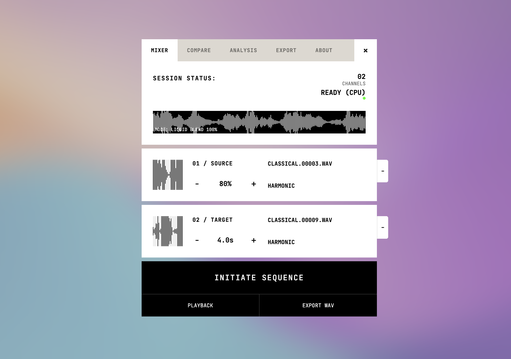
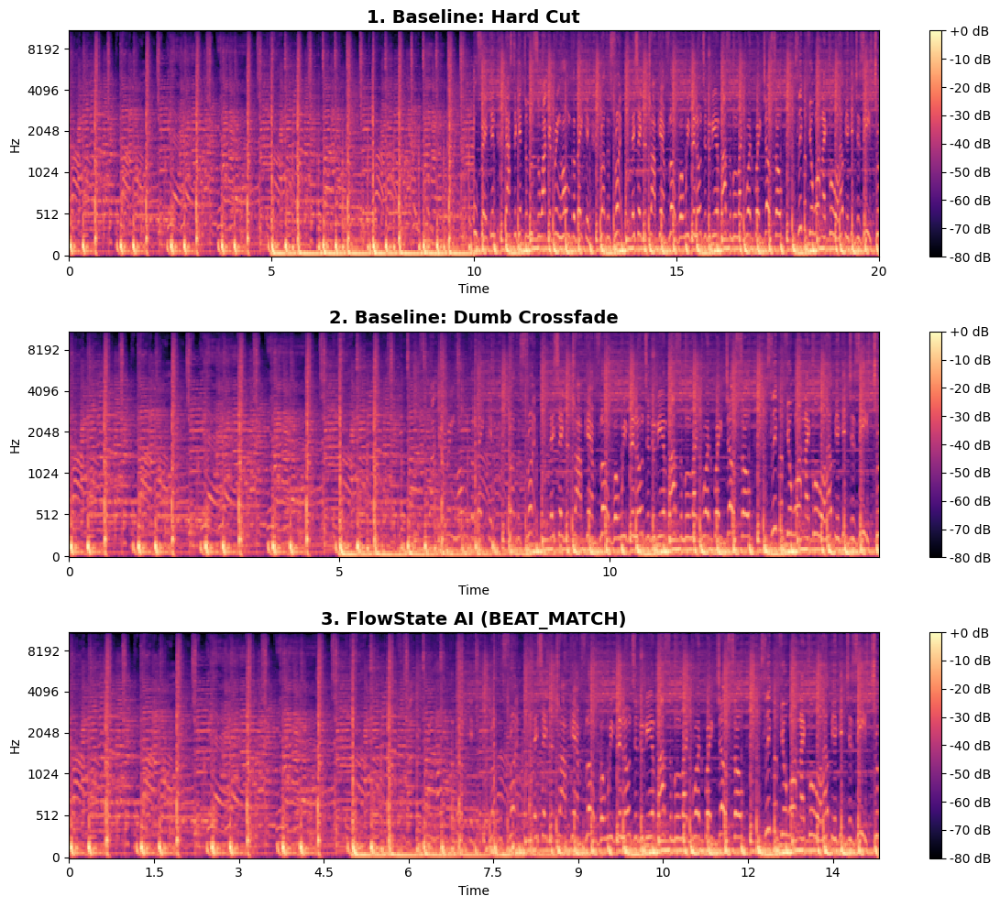
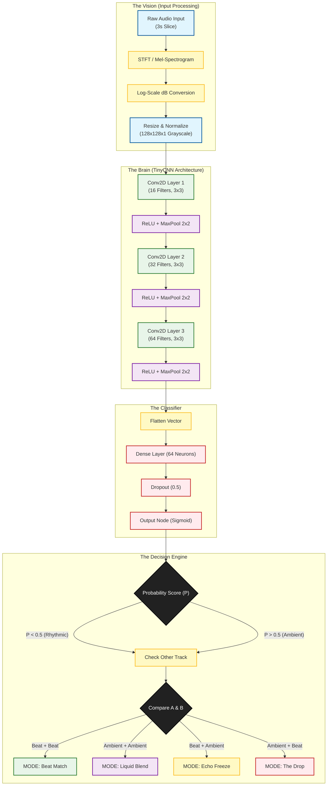

# FlowState: Neural Audio Transition Engine

> **"A DJ in your browser."**

> FlowState is a research initiative to bridge the gap between Computer Vision and Audio Engineering. It uses a Convolutional Neural Network (CNN) to "see" the texture of music and orchestrate professional-grade transitions autonomously.

[](https://jeffasante.github.io/FlowState-research/)
_Click the image above to experience the **Interactive Demo**._


_Figure 1: Comparison of transition techniques. Top: Hard Cut (Jarring). Middle: Standard Crossfade (Muddy/Clashing frequencies). Bottom: FlowState AI (Clean filtering, tension creation, and beat-synced drop)._

**Audio Previews:**

- [Baseline: Hard Cut (Listen)](samples/Baseline-Hard-Cut.wav)
- [Baseline: Crossfade (Listen)](samples/Baseline-Dumb-Crossfade.wav)
- [FlowState AI: The Drop (Listen)](samples/FlowState-AI-DROP.wav)

---

## The Problem

Traditional auto-mixers (like those in Spotify or iTunes) use "blind" crossfades. They simply fade Track A out while fading Track B in.

**The Result:** Frequency clashing (Mud). When two kick drums play out of sync, or two basslines overlap, the audio quality degrades.

## The Solution

FlowState treats Audio as **Images** (Mel-Spectrograms).

1. **Vision:** A TinyCNN analyzes the texture of the audio (Rhythmic vs. Ambient).
2. **Decision:** The AI selects a transition strategy (e.g., "The Drop" or "Echo Freeze").
3. **Execution:** A DSP engine aligns the beat grid and applies aggressive filtering to create physics-based transitions.

---

## Technical Architecture

### 1. The Brain (Computer Vision)

- **Model:** Custom `TinyCNN` (Lightweight, <100KB).
- **Input:** Mel-Spectrograms (128x128).
- **Dataset:** [GTZAN Dataset - Music Genre Classification](https://www.kaggle.com/datasets/andradaolteanu/gtzan-dataset-music-genre-classification).
- **Training:** PyTorch on Apple Silicon (MPS) M4 Chip.

### Architecture Visualized



### 2. The Muscle (DSP and Psychology)

- **Prototyping:** Python (`librosa`, `pydub`, `scipy`).

---

## Research Methodology: Iterations and Lessons

This project evolved through several failures to arrive at the final "Dub Throw" architecture.

### Phase 1: Data Slicing Strategy

- **What we did wrong:** Initially, we sliced random 3-second chunks from anywhere in a song.
- **The Failure:** The model got confused by "middle 8s," guitar solos, and vocals. It couldn't distinguish a Verse from a Drop.
- **The Fix:** We moved to **Intro/Outro Slicing**. By training only on the first and last 15 seconds of tracks, the model learned the fundamental "mixable" textures (Drum Patterns vs. Pads) with near-perfect accuracy.

### Phase 2: The "Physics" of the Drop

- **What we did wrong:** Our first AI transition applied a filter to Track A _and_ Track B to make them match.
- **The Failure:** This killed the energy. As per the **Theory of Contrast**:
  > If you filter Track B to match Track A, you get: `Thin Audio` -> `Thin Audio`. The listener waits for the bass, but it feels weak.
- **The Fix:** We implemented the **"Maximum Contrast"** rule.
  > `Thin Audio` (Track A Filtered) -> `BOOM` (Track B Full Bass).

### Phase 3: The "Dub Throw" (The Glue)

- **The Insight:** Even with the contrast fixed, the transition felt "dry". It sounded like the music stopped by accident.
- **The Solution:** We implemented a **Dub Throw**.

  1. Aggressive High-Pass Filter on Track A (removes bass).
  2. Capture the last split-second in a "Reverb Chamber".
  3. Let that Reverb Tail ring out _over_ the silence and into the start of Track B.

  **Result:** Track B hits with full bass, but the high frequencies of A shimmer on top, gluing the mix together.

### Phase 4: Browser Implementation & The FFT Challenge (Web Audio API vs Python)

- **The Problem:** Our JavaScript model predictions were wrong (`0.000` or random output) even though the model was perfect in Python.
- **The Failures (What we tried):**
  1. **Web Audio AnalyserNode:** The native browser `AnalyserNode` smooths data for visualization (Fast Fourier Transform), which is great for graphics but terrible for ML accuracy. The frequency bins didn't match `librosa`.
  2. **Approximation:** We tried calculating energy in the time-domain to "fake" a spectrogram. This failed because it lost all frequency nuances.
- **The Solution:** We had to **replicate Python's logic exactly** using a JS port of the Cooley-Tukey algorithm ([fft.js](https://github.com/indutny/fft.js/blob/master/lib/fft.js)).
  - **Exact FFT:** Implemented raw FFT with Hann windowing manually.
  - **Mel Filterbank:** Re-wrote the specific HTK-formula filterbank used by `librosa` in plain JS.
  - **Normalization:** Matched the exact min-max scaling (-80dB to 0dB) used during training.
  - **Result:** The browser now generates pixel-perfect spectrograms that effectively "trick" the Python-trained model into thinking it's running in a local environment.

---

## Results

| Model        | Accuracy | Inference Time  |
| ------------ | -------- | --------------- |
| TinyCNN (v2) | ~99%     | < 5ms (M4 Chip) |

**Visual Proof:**

As seen in the header image, the FlowState algorithm (Row 3) successfully:

1. **Clears the Low End:** The bottom frequencies turn black (0dB) 4 seconds before the transition.
2. **Syncs the Grid:** Track B enters exactly on the Downbeat.
3. **Avoids Clashing:** Unlike the Standard Crossfade, there is zero frequency overlap in the sub-bass region.

---

## Usage (Python Prototype)

```bash
# Install Dependencies
pip install torch librosa pydub matplotlib

```

---

## References

- **GTZAN Dataset:** [Music Genre Classification](https://www.kaggle.com/datasets/andradaolteanu/gtzan-dataset-music-genre-classification) by Andrada Olteanu.
- **FFT Library:** [fft.js](https://github.com/indutny/fft.js/blob/master/lib/fft.js) by Fedor Indutny.
